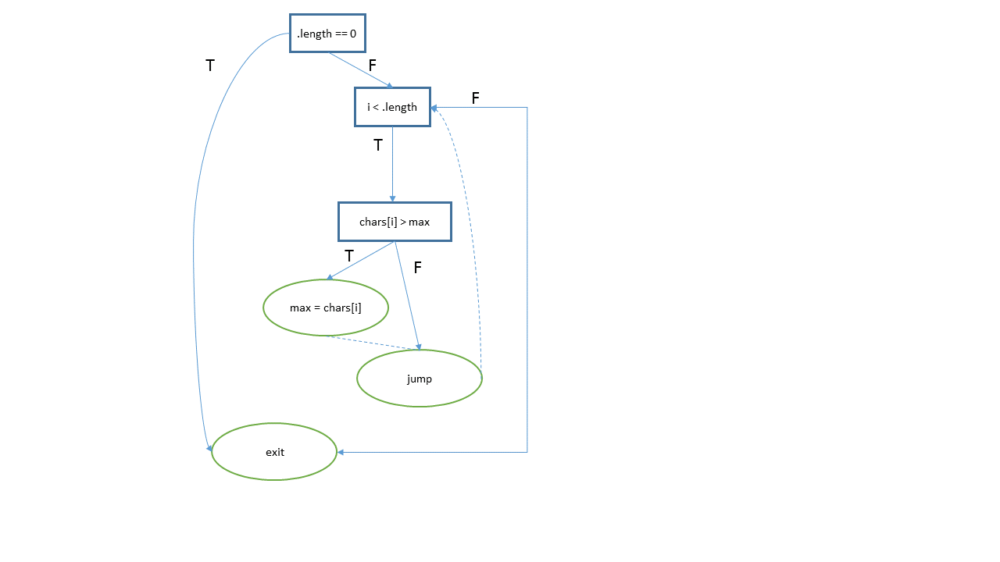

### Lab


### Branch Coverage

##### Example

```
private static int maxValue(int[] chars) {
	int max = chars[0];
	for (int i = 0; i < chars.length; ktr++) {
		if (chars[i] > max) {
			max = chars[i];
		}
	}
	return max;
}
```

1. The program graph.
   

2. There are 3 decision nodes and 6 branches.

3. For a testsuite with the following test cases, how many branches are covered?

* maxminValue( [1,1,1,1] );
* maxminValue( [3,2] );

**Answer: 4/6**

Why? 

* The true branch of the `.length == 0` is never taken.
* The true branch of `chars[i] > max` is never taken.

##### Exercise

Someone decided to extend the method to calculate the min and max at the same time.

```

// Calculate the min and max value of an array of characters.
// min is stored in [0], max in [1].
private static int[] maxminValue(int[] chars) 
{
	if( chars.length == 0 )
		return null;
	
	int[] minmax = {chars[0], chars[0]};

	for (int i = 0; i < chars.length; i++)
	{
		if (chars[i] > minmax[1]) {
			minmax[1] = chars[i];
		}
		else if( chars[i] < minmax[0] )
		{
			minmax[0] = chars[i];
		}
	}

	return minmax;
}
```

1. Draw the program graph.
2. How many branches and decisions are there in total?
3. What the branch coverage `__ / __` ?

